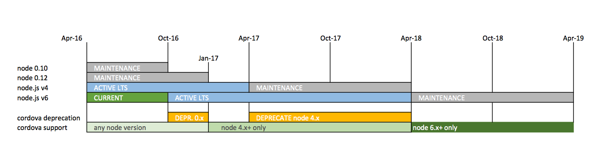

# Deprecation of node.js 0.x and upgrade to a minimum usage of node.js 4.x in Apache Cordova 
- Status: Proposed

Right now, all the platforms and plugins require a minimum of `node 0.10` to be installed. `node 0.10` has been out of LTS [1] for a while now, and its maintenance period (security bug fixes) **stops on Oct 2016**. `node 0.12` will be out of maintenance **Jan 1st 2017**.

I propose two distinct deprecation periods.

Starting **Oct 1st 2016**, we will deprecate our `node 0.x` support, and we will recommend users migrate to using a more recent version of `node` immediately (at least `node 6.x`). The `node 0.x` deprecation period will run for **3 months**, and it will end on Jan 1st 2017. 

Starting **Jan 1st 2017**, our support for `node 0.x` is over, and we will only support `node 4.x` and greater. 

Staring **April 1st 2017**, we deprecate our `node 4.x` support, and we will recommend users migrate to using a more recent version of `node` immediately (at least `node 6.x`). The `node 4.x` deprecation period will run for **12 months** and it will end on April 1st 2018.

Starting **April 1st 2018**, our support for `node 4.x` is over, and we will only support `node 6.x` and greater.

`node 6.x` will be on active LTS **Oct 2016** (thus the default and recommended version to download on [nodejs.org](http://nodejs.org)) and should be the version we recommend for users to upgrade to, during both deprecation periods.

What does `node 6.x` give us? `99% ES2015 (ES6)` support [2], and `100% ES2016 (ES7)` support [3].

## Proposed Timeline

**Oct 1st 2016** - deprecate use of `node 0.x`. Make sure all AppVeyor/Travis CI builds still test using `node 0.x` as well as `node 4.x` and greater. Add a requirements check that will print out a deprecation notice if they are using a node < 4, and telling them to upgrade to a minimum of 6.

**Jan 1st 2017** - Stop `node 0.x` support. Make sure all AppVeyor/Travis CI builds only test for `node 4.x` and greater. Safe to use some ES6 features in Apache Cordova (built in Promises, let, const, arrow functions). Tools and platforms will have to bump a major version.

**Apr 1st 2017** - deprecate use of `node 4.x`. Make sure all AppVeyor/Travis CI builds still test using `node 4.x` as well as `node 6.x` and greater. Add a requirements check that will print out a deprecation notice if they are using a node <= 4, and telling them to upgrade to a minimum of 6.

**Apr 1st 2018** - Stop `node 4.x` support. Make sure all AppVeyor/Travis CI builds only test for `node 6.x` and greater. Safe to use ES6 and ES7 features in Apache Cordova. Tools and platforms will have to bump a major version.

## Sources
 
[1] [https://github.com/nodejs/LTS](https://github.com/nodejs/LTS)

[2] [http://node.green/#ES2015](http://node.green/#ES2015)

[3] [http://node.green/#ES2016](http://node.green/#ES2016)

