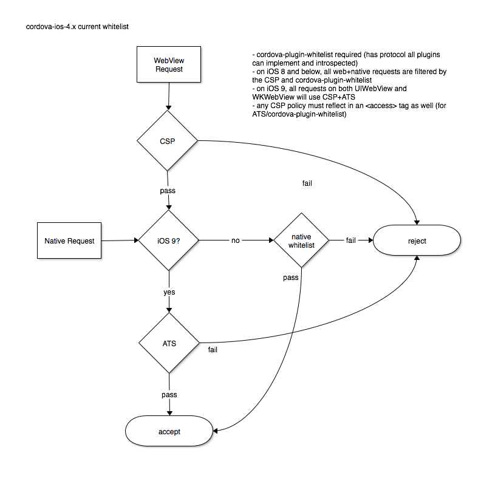
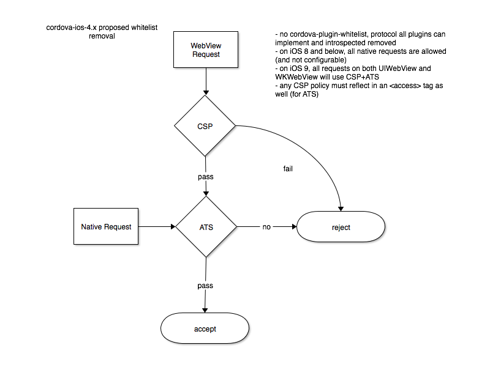

# Proposal to Remove the Cordova iOS Native Whitelist

This proposal is to advocate for the removal of the usage of the cordova-plugin-whitelist plugin in cordova-ios-4.x.

In the diagrams, CSP refers to [Content-Security Policy](https://developer.mozilla.org/en-US/docs/Web/Security/CSP) and ATS refers to [App Transport Security](https://developer.apple.com/library/ios/documentation/General/Reference/InfoPlistKeyReference/Articles/CocoaKeys.html#//apple_ref/doc/uid/TP40009251-SW33).
These two components are built-in to iOS, and are not part of Apache Cordova.

## Current Whitelist System

All connections in the WebView *must* be whitelisted in the `CSP` *and* also be whitelisted in native through the `<access>` tag in `config.xml`. In the last released version of the `cordova-cli`, all `<access>` tags are automatically converted to `ATS` directives in the app's `Info.plist` file. 

There is a deficiency in `cordova-plugin-whitelist` in that `WKWebView` connections are not whitelisted while on iOS 8 (because its connections cannot be intercepted using NSURLProtocol). On iOS 9, `WKWebView` connections are whitelisted and intercepted by ATS.

There is one difference in whitelisting through `ATS` and cordova-plugin-whitelist: a wildcard `*` in `cordova-plugin-whitelist` means all connections are accepted, while in `ATS` it means the same except that you can also restrict certain domains to connect through https or a certain TLS version, for example.

The way `cordova-plugin-whitelist` works is by [implementing a protocol](https://github.com/apache/cordova-ios/blob/master/CordovaLib/Classes/Public/CDVURLRequestFilter.h) -- in the platform *all* plugins are then iterated through, and checked whether they implement a protocol method, and [each plugin is asked](https://github.com/apache/cordova-ios/blob/0ec2949d9b37495da6504867bfb371bd868242f0/CordovaLib/Classes/Public/CDVViewController.m#L518) whether a request is to be allowed. This means that any plugin that implements the protocol method can *veto* a request.

It seems that this code was added to provide a generic way to allow whitelist as a plugin -- the utility of these protocol methods for other uses are not apparent.

## Proposed Whitelist System

TODO: